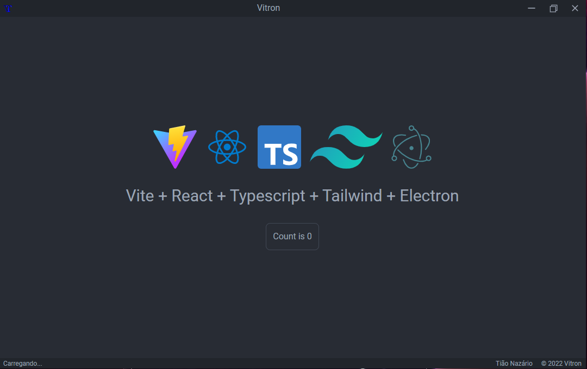

<h1 align="center">
</img>
Vitron
</h1>

## :memo: Description

Template to create project with technologies: Vite + React + Typescript + Tailwind + Electron.

[Link to Youtube](https://www.youtube.com/@tiaonazario)

## :books: Functionalities

- Run react on electron.
- Use the Vite.
- Use typescript.
- Use Electron.

### 🖥 Design



## 👨‍💻 Technologies used

 
## :rocket: Running the project
 
To run the project, it is necessary to follow the next steps.
  
### Step 1 - Clone the repository

```git
git clone https://github.com/tiaonazario/vitron.git
```
 
### Step 2 - Install the packages

```powershell
npm install
```

ou


```powershell
yarn install
```

### Step 3 - Execute

```powershell
npm run dev
```

```powershell
yarn dev
```

## :handshake: Collaborators

<table>
  <tr>
    <td align="center">
      <a href="http://github.com/tiaonazario">
        <br>
        <sub>
          <b>tiaonazario</b>
        </sub>
      </a>
    </td>
  </tr>
</table>

## :dart: Project status

Ready, but upgradable